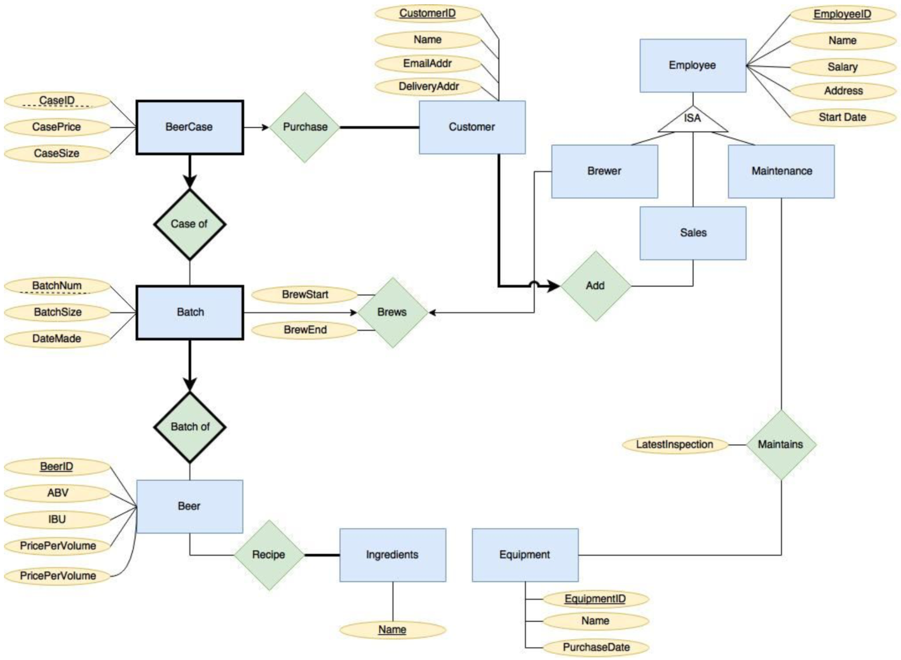

# Brewery-Management-System-And-Database
A mini brewery database system blueprint for every man's dream.

### Purpose
The main objective for any micro brewery is to brew tasty beers. Usually, a microbrewery brews multiple types of beers that use different ingredients, have different brew times, and result in beers with different attributes such as alcohol percentage and bitterness. Once brewed, each batch of beer needs to be packaged into cases before shipment to customers. The brewing, packaging, and sales processes require some machinery and equipment that also require staff to operate and maintain. Finally, throughout this process, the inventory of beer, ingredients, and equipment need to be updated and monitored. This database system is designed to help the Super Duper Microbrewery manage the information for each of these objectives.

### Scope and Special Requirements
Our database for the Super Duper Microbrewery is for a single location, not a network of breweries. Shipping/delivery is outsourced so is not accounted for in this database. Purchasing (of ingredients, equipment, and all other resources) is externally managed and thus not included in our scope. The same can be said for payment, hiring, leave management, and other administrative processes.

### Terminology
ABV - Alcohol By Volume
IBU - International Bitterness
Units Beer - Fun Juice

## Database description
### Entities and their attributes:
The following entities will be stored in tables of a relational database:
* Beer:​ A type of beer, determined by its inputs: ingredients and brew time. The resulting beer will have attributes of: name, alcohol by volume (ABV), international bitterness units (IBU). [Example: Cranberry Sour Ale, 6.0%, 15 IBU, “Hops-1kg, high-acidity yeast-0.05kg, sugar-0.05kg, cranberries-0.2kg.”, 42 days]

* Batch:​ Beers are brewed in batches, each batch is a weak entity can be identified by a unique batch number for the type of beer (the foreign key). Other attributes of a batch are the batch size and the date made.

* Case:​ Each batch is packaged into cases (of bottles) for sale to customers. We store the case price and the case size.

* Ingredients: ​An ingredient is representative of the name of what ingredients are present in each type of beer, akin to what would be printed on the back of an ingredients label for each bottle.

* Inventory: ​The inventory is an overarching entity that contains the name and amount of how many ingredients, equipment, batches, and cases of beer are being held in the microbrewery itself. Each inventory item is uniquely identified by the name of the stock, and the amount in stock is also recorded.

* Equipment​: Special equipment used for the brewing of beer that needs to be maintained by the maintenance staff and regularly inspected to ensure that beer can be brewed correctly. Employee:

* ​Employees exist in the database to be linked to other entities and track which employee interacts with which other items. Employees are identified by a unique employee ID, other attributes include name, salary, address, and date of start of employment. The subclasses of employee are detailed below.

* Brewer: ​The brewer is a subclass of employee that must be linked to each batch of beer to know who brewed what beer on which dates.

* Sales: ​The sales employee interacts with customers and secures business deals, and in the database needs to be linked to which customers the sales employee is able to secure.

* Maintenance:​ The maintenance staff is an employee who is in charge of maintaining all the equipment pertinent to the brewing of beer, and performs regular inspections to ensure the quality of all piece of equipment.

* Customer: ​The customer is a person who buys cases of beer from the microbrewery, and has their information stored in the database. Customers are identified by a unique customer ID, other attributes include name, email address, and delivery address.

### Relationships:
* Batch of: ​A batch consists of entirely one type of beer, so this relationship is used to describe what beer each batch is made of.

* Case of: ​Every batch of beer can fill many cases of beer, but every case can only consist of one batch of beer.

* Recipe: ​Every type of beer is made of its own unique ingredients.

* Ingreditents_Stored In_Inventory: ​Ingredients that are used in recipes need to be tracked to see how much of each ingredient is being held in the micro brewery’s inventory.

* Has: ​Equipment needs to be stored in the inventory as well, to keep track of what is currently available to be used by the brewers.

* Maintains: ​The maintenance staff needs to maintain the equipment to make sure it's running up to par, and also keep track of the latest inspection date to know when each equipment needs to be inspected next.

* Add: ​Sales representatives need to add customers to the database after they secure business deals, and customers need to also be paired to the sales representative that partnered them.

* Brews​: Brewers need to paired with batches as they are made, and also to know the brew start and end date to know the age of the beer.

* Batch_Stored In_Inventory: ​Every batch needs to be kept track of in the inventory to know how much is in each batch still, and to know how many barrels exist in the microbrewery.

* In stock: ​ Cases of beer need to be inventoried to know how much is available in the microbrewery to be sold and consumed.

* Purchase: ​Every transaction made by customers needs to be tracked to know which cases of beer and how many are being given to a customer at a time.

### ER Diagram

### Development Status:
* ER Diagram: Done
* Relation model: Done
* SQL database scheme: Done
* Automated data generator written in Java: Done
* MapReduce with Piglatin: Done

### Members:
* Tynan Davis
* Alex Wong
* Andrew Tran
